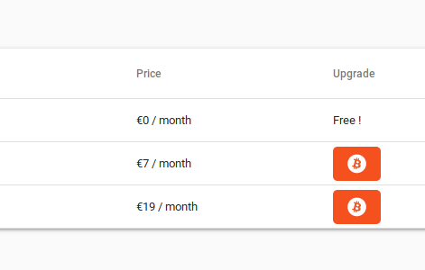

title: Integrate Coinbase Commerce with Django
description: Here's how to accept crypto payments on your website with Coinbase Commerce. 
-

EDIT: This post was originally posted on Medium, but I decided to remove it because of Medium's predatory practices.
I fixed a few typos at the same time.

## Integrate Coinbase Commerce with Django 
 
I’m quickly going to show you how to integrate Coinbase Commerce with Django.

There won’t be any bullshit and I will assume you have a basic knowledge of Django. I won’t be cover any front-end thing.

**We’ll do it in two parts :**

* What is the typical Coinbase Commerce paying process?

* How do we integrate with it on the backend?

### What is the typical Coinbase Commerce paying process?

**1 — Your client is on your website, and clicks the “pay with crypto” button.**

*You know … That little button that feels so good*

Congratulations! You’re about to gain money!

Bam! The user clicks and a nice modal is showed to him (Which you didn’t make, otherwise it wouldn’t be that beautiful you little backend developer)

*Paying with BTC on Coinbase Commerce*

After giving some optional infos (optional, you can configure it on your Coinbase Commerce Account) he’ll be prompted with this, to tell him to pay your beloved product.

He then pays it, and gets on his email address a code, his order code.

He then needs to send you his code so that you can be sure that he’s a legit customer.

But because no one wants to pay someone just to confirm orders, we’re going to automate all of that with a nice little webhook and a nice little form.

**2 — Coinbase Commerce notifies you that you’re getting richer by sending you a webhook POST request.**

You’ll need to configure it in the Coinbase Commerce UI, and we’re going to learn how to create it in the present tutorial.

This request contains some very interesting things :

* An order ID, the same that has been communicated by mail to your customer, that you’ll need to save on your database

* The amount of money you’ve just gained

We’re going to store it.

**3 — Your client claims his product with a form on your website**

You know how to handle a form with Django, otherwise you have nothing to do here.

 

*My button looks like that*

    </img>

*And gets you here*

Then, the server credits the product to the client. You know how to do it.

### How do we integrate with it on the backend ?

*Here’s the million dollar question!*

**1 — Receiving the webhook**

First, we need a model to save payments. 
 

Then, we’re going to setup that webhook. Let’s tap into the urls first:

And here’s for the godly webhook!
I’m assuming you have a COINBASE_SECRET field in your settings.py file.

Here, we're getting the request and authenticating it with the secret key to check that it isn’t some evil hacker trying to steal your product.

**2 — The client form**

I’m going to let you do it yourself from here. The tricky part is the coinbase webhook and its authentication, the rest is quite straightforward.
You just need to get the CoinbaseOrder by his order_id and send the product to the client if the value of his order is the same than the one of the product the client claims.

### Wrapping it up:

Last thing you need to do, register the webhook into the Coinbase Commerce UI.
Only subscribe to “Confirmed charge” events, you don’t want to give your product to people that fail to pay it.

### The big conclusion

All of that was brought to you by Alex Toussaint, I’m a developer and all those snippets are coming from my project : [Kaktana](https://kaktana.com)

It’s a 100% user-configurable, technical analysis and cloud-based trading bot that lets you invest in cryptocurrencies safer than ever. You’re using basic logic conditions to create your strategies that the bot will apply to the letter, ensuring you huge endless profits. Go check it out!

### The (2) big conclusion

Cryptocurrency is the future! 
We’re going to get rid of bank monopolies and get rid of those stupid fees. Just enjoy getting paid so easily!

*You can also give a look at my awesome open-source contributions at [https://github.com/alextousss/](https://github.com/alextousss/)*

Alex Toussaint

