title: "How I built an ultrasonic 3d scanner"
-------------------------------
## How I built an ultrasonic 3d scanner

Four years ago, I wanted to build an autonomous drone to deliver me Coke cans. For that, I needed an accurate 3D map of the surroundings of my drone to avoid walls and objects in its way. Lidars were too expensive, SLAM didn't work well. There were ultrasonic sensors, but they could only give out the distance to the nearest object in a 40° cone, which wasn't enough for me. 

But, if humans can locate the exact direction of a sound, why can't an ultrasonic sensor do it too? That would allow me to scan in 3d. 

<!---->

<!--

-->

### First idea: one emitter and multiple receivers.
A transmitter emits a wave, which bounces on objects, and two receivers triangulate the echo to put it on a map. 
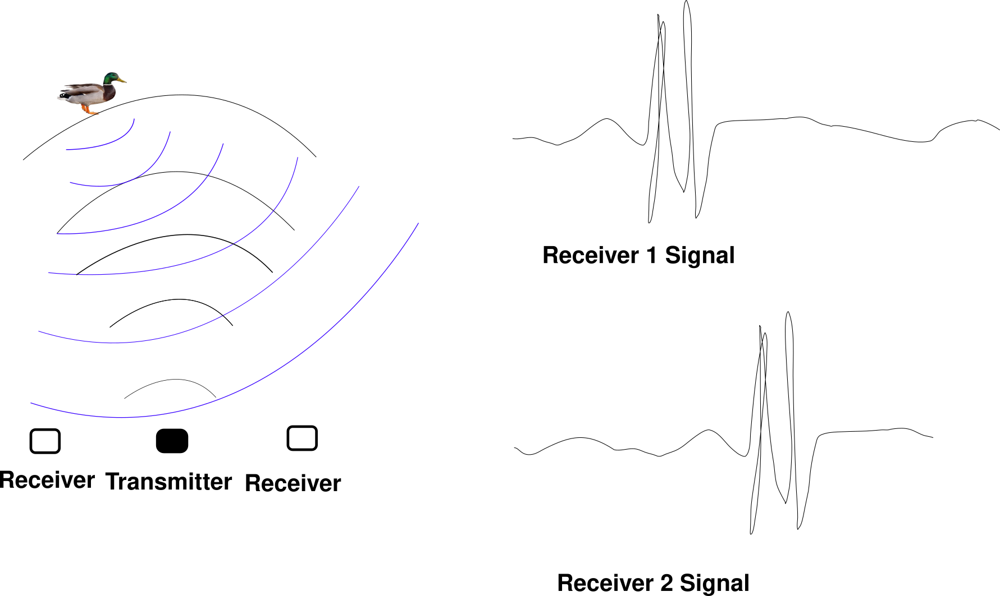
But, this only works well for one object. As soon as there's a second one at the wrong spot, you can't tell apart one's echo from the other's.
[^1]
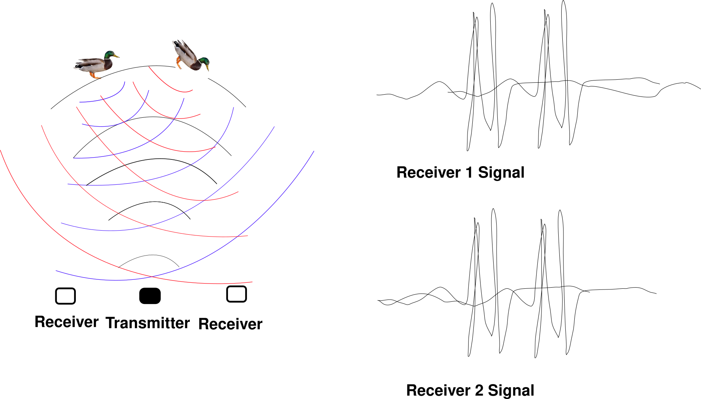

A few guys built scanners based on that. They work well for spotting fingers for a virtual keyboard, but can't handle more than a few objects.

### Two years later: back to the drawing board.
What saved me was the principle of interference. Let's say we have two sound waves in space, let's call them $`F_1(M)`$ and $`F_2(M)`$, where $`F_1(M)`$ returns the amplitude (how much the wave moves the particules) at point M.

$`F_1(M)`$ can be positive as it can be negative. When you see waves on the water, there are places where the water line is below its average ($`F_1(M)`$ negative) and places where the water line is above the average ($`F_1(M)`$ positive). Now, if we call F(M) the "final" displacement of the particles at the point M, we're going to have $`F(M) = F_1(M) + F_2(M)`$.

But what happens in a situation where $`F_1(M) = -F_2(M)`$? Well $`F(M) = 0`$. The displacement in M is zero even though there are two non-zero waves there. This phenomenon is called destructive interference. Interferences rule how all wave sources radiate in space. The lightning patterns on the surface of water, the equations ruling mirrors, lenses and antennas all derive from this superposition principle.

Now it turns out that if you arrange a lot of emitters regularly in a plane, the wave will stay constrained inside of a beam like the one of a lighthouse. 
The following arrangement of emitters, all in phase: 

$`[E(t)]`$   $`[E(t)]`$  $`[E(t)]`$  $`[E(t)]`$  $`[E(t)]`$  $`[E(t)]`$  $`[E(t)]`$  $`[E(t)]`$  

Will give out a beam like that [^2]

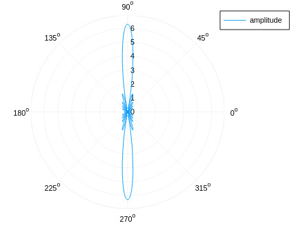

The real miracle is that if you delay each emitter's emission time by a linear amount $`n\phi`$, for instance like that:

$`[E(t+\phi)]`$  $`[E(t+2\phi)]`$  $`[E(t+3\phi)]`$  $`[E(t+4\phi)]`$  $`[E(t+5\phi)]`$    

Then, the angle at which the beam will point will be proportional to $`\phi`$! 
If we control $`\phi`$, we control where the beam points at!

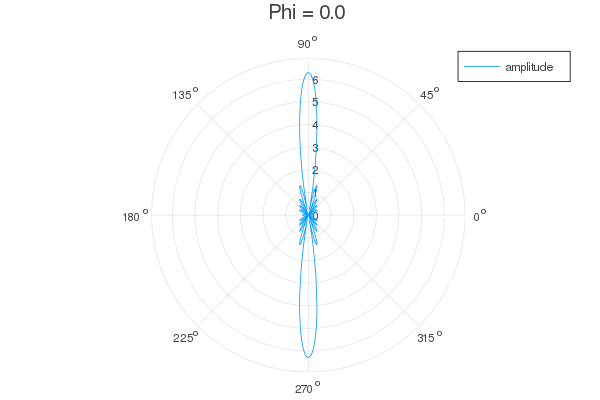

With that principle, I can build a 3D scanner using the following algorithm:

 - Send wave at a specific place 
 - Wait for the echo 
 - Plot the echo 
 - Send wave in another direction 
 - Wait for the echo 
 - Plot the second echo  

.. done all over space, this would allow me to scan my environment like a lighthouse.

### If it's so easy, why hasn't anyone done it before?
The problem is that if the emitters are too far apart, there won't be just one beam but three beams. With three beams, scanning is impossible. 
The problem is that the emitters have to be as close as half the wavelength. 

But, you usually want a transducer to be larger than one wavelength so that it radiates only forward and not too much on the sides. Therefore, all commercially available ultrasonic transducers were much wider than half the wavelength!
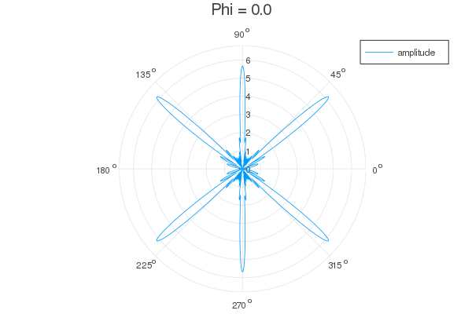

I searched on Aliexpress and Banggood for hours, there was no way to find ultrasonic transducers small enough.

My project was on a dead-end for a second time. I had put so much hours building simulation code. I couldn't just lose it like that.
After entire evenings spent trying to understand why two additional beams would appear when the emitters were too far apart, some blinking flash of intuition stroke me. 

If I imagine my emitters as plates all touching each other, the wave that they produce can only go in the direction of the beam. There can be no second and third beam on the sides. It's one of these intuitions that are hard to explain. 

Until now, my simulation and almost all the ones you can find online assume that the emitters are dots with zero radius. And by simulating these sources not as dots but as "plates" (ie, 10 dots in phase put next to each other), the radar works!

There's still a second beam that appears at high angles, and the max scanning angle is still lower than if my emitters were closer than half a wavelength but it should still be able to work!   

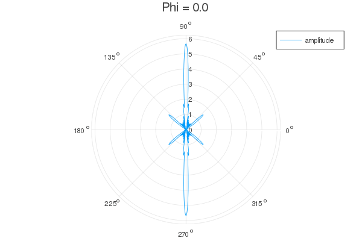

### Time for frying electronics
I planned to make a 10x10 grid of 10mm transducers. That would make an emitter 10cm x 10cm wider. I thought that driving a phased array would be similar to driving an array of LED.

I bought hundreds of transducers for $50 on Aliexpress.
To me, all I needed was 74HC595 Shift Registers (that's what they use for driving many LEDs) and an NPN transistor to convert the 5V of the shift registers to the 40V of  the ultrasonic transducers. Then, I'll solder hundreds of these components on a protoboard. I've already done rocket parachute timers on protoboards, it should be the same.

After I received my components, I tried to make an ultrasonic transducer work. When D13 is HIGH, current flows in the transistor and opens it to the alimentation next to it.
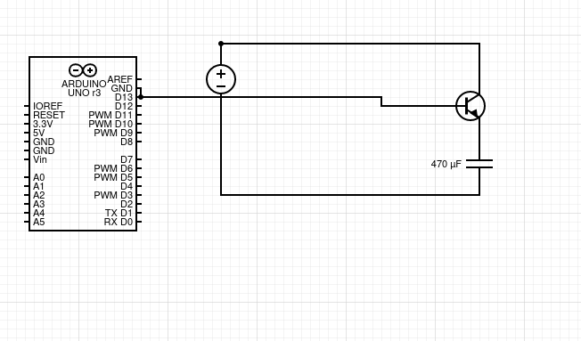

If you've done a bit of electronics before, you've probably loughed out very hard.
An ultrasonic transducer is rougly equivalent to a capacitor.
A capacitor is like a water resevoir, except for electrons.
Therefore, to drive it I need to empty that capacitor and to fill it again 40 000 times per second. The NPN capacitor here only cuts out the alimentation of the capacitor, but there's nothing to discharge it 

After a few days of trying to understand why an ultrasonic wasn't working like an LED, I understood that and tried another circuit, the half-bridge:
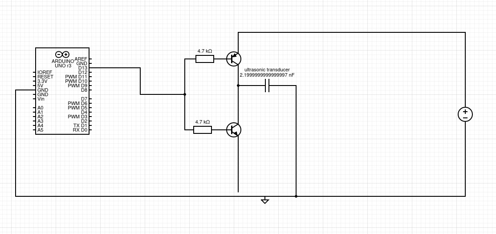
When D13 is HIGH, the top transistor is open and the bottom transistor is closed. Currents goes from the capacitor to the ground, the capacitor gets discharged.
When D13 is LOW, the top transistor is closed and the bottom transistor is open. Current goes from the 40V to the capacitor. 

At least, that was in theory!

In practice, this circuit only works with supply voltages lower than the voltage of the arduino signal, 5V in my case. The reason for that (and it again took me 5 days to figure it out) is that PNP transistors (the kind of the top transistor) are closed when current flows from the top pin to the left pin, and 5V (my arduino's voltage) isn't enough to stop a voltage from a 40V source to induce current. I need to drive it with a 40V signal, which means ANOTHER transistor!

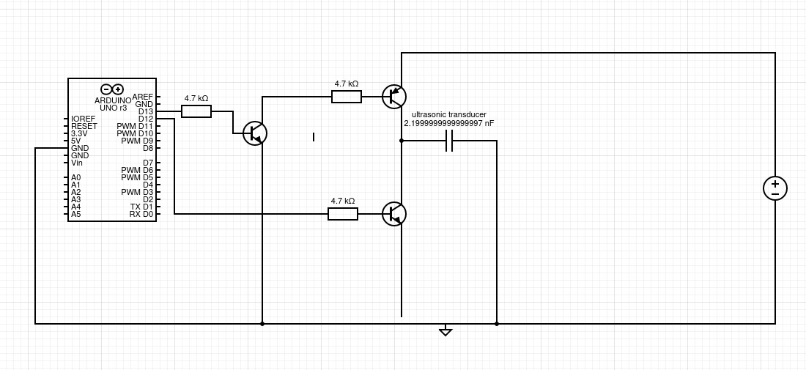
Here, the leftmost NPN transistor drives the PNP. The consequence of that is that I need three transistors, three resistors and two arduino pins for each transducer. That's 300 transistors and 200 arduino pins ie 200/8 = 25 shift register pins. That's too much to solder manually.

But at least, this circuit works. It just needs a bit of miniaturization. 

Though, with a functional transmitter, I could get my first beam. I connected 8 emitters in parallel to a half bridge and got a beam!
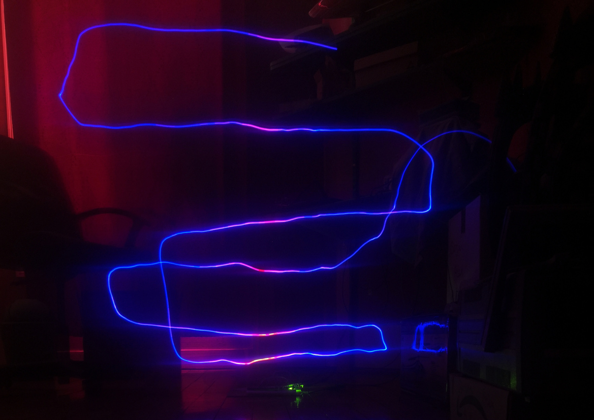
The emitter is the green light on the bottom. Blue is low signal, white/red/purple is high signal.
I used a Teensy 3.2 which shows the signal intensity as a color on a LED. Then, I took a long-exposure photo while making the teensy travel in the beam. 

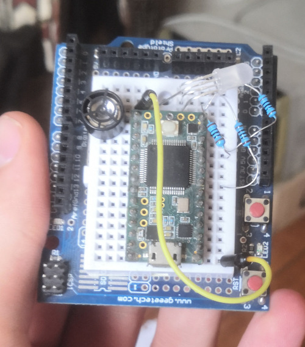 

My emitter was working correctly, the beam size beeing close to simulations. 

### Scaling to 100 emitters
Then, I tried to build a half-bridge directly from shift registers. I bought shift-registers that did what the PNP transistor did and shif-registers that did what the NPN did. Those were open-gate and open-drain shift registers. 

It sort of worked, but the timings were different between both shift registers so there would be times were both shift registers would be passing current and there would be a short circuit, burning these components. The open-gate ones had really shitty timings at high frequencies, so I got back to the drawing board.

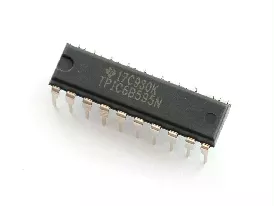
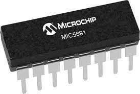

Finally, I realized that both NPNs (the one driving the top PNP and the one putting the capacitor to the ground to empty it) could be replaced by an open-drain shift register (which worked well in my latest experiment). So I finally settled on that. I would only need two shift register pins, a transistor and a resistor for each transducer. That amounts to 25 shift registers, 100 transistors and 100 resistors to solder.  

I prepared the protoboard, turned on the soldering iron and ... Did nothing. There were too many components for such a small size. It was a nightmare to solder. I needed to build a PCB. 

I had never done any EDA before, so I started to learn and use KiCad. Two days later, I had my PCB ready to be manufactured!  
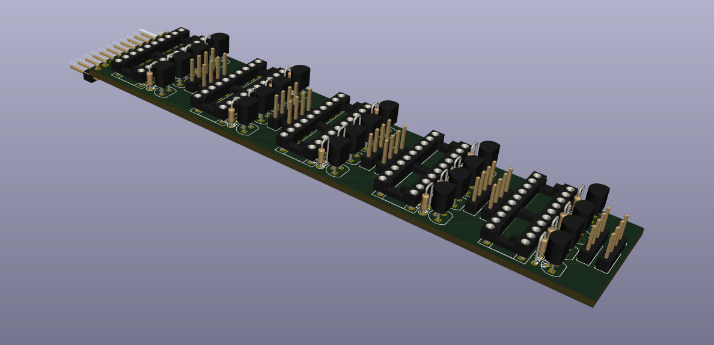

With jlcpcb.com I had my 10 PCBs a week later for $20, including $18 for the fast shipping.
I hate having to use a chinese company for a job that could be done in France, but there were no local companies offering the same king of service. Overall, I was pleased with the experience.

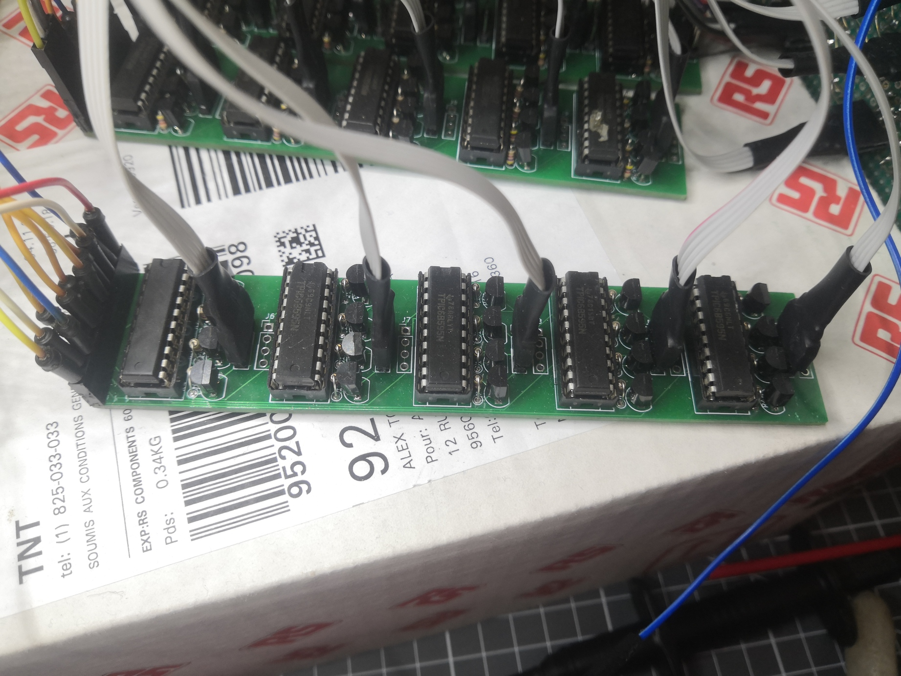
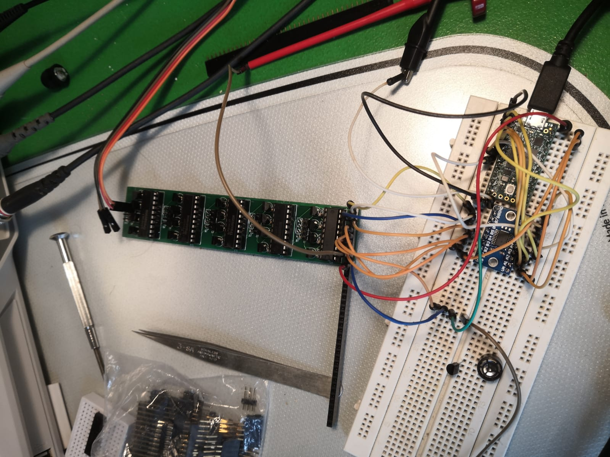

After an evening of soldering the $`8*25+2*100+3*100=700`$ pins of my PCBs, I hooked up the Teensy and... It didn't work!
I had forgot to set a pin to the ground on each of the TPICs, so after adding 25 wires to my PCBs, it worked!

### Mounting the 100 emitters

Then, I had to tightly pack my 100 emitters in a 10x10 grid and connect all of them to my half-bridges. I've started by doing 40 of them: 

From bottom to top: Teensy 3.6 which generates the signals, TS1080 to convert the 3.3V signals to 5V, half-bridge PCBs, transducers.
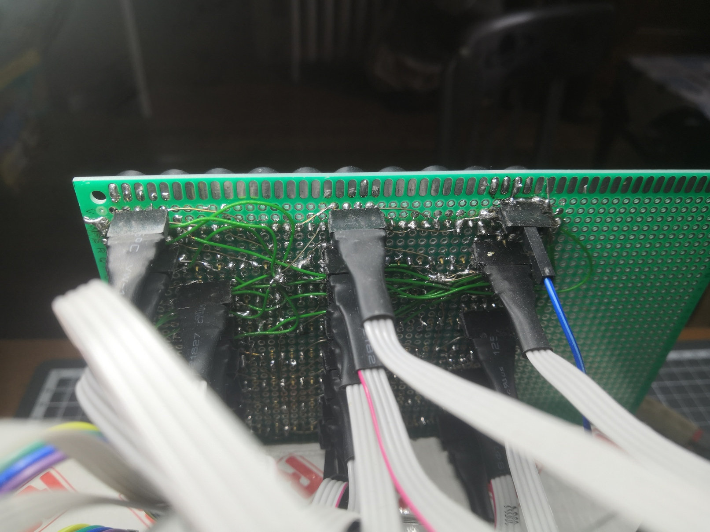
All wires are soldered a l'arrache to the transducers through headers (so I can replace or change the polarity of individual transducers easily).
This is the most disgusting and hard soldering I've ever done, but it works.

### Receiving the signal
I've started doing experiments with beamforming on the reception side for additional precision. I've built a protobard with 9 transducers in a cross. I googled for "audio amplifier" and used the first schematic I found. It used LM386. I removed the decoupling caps because I had none. 
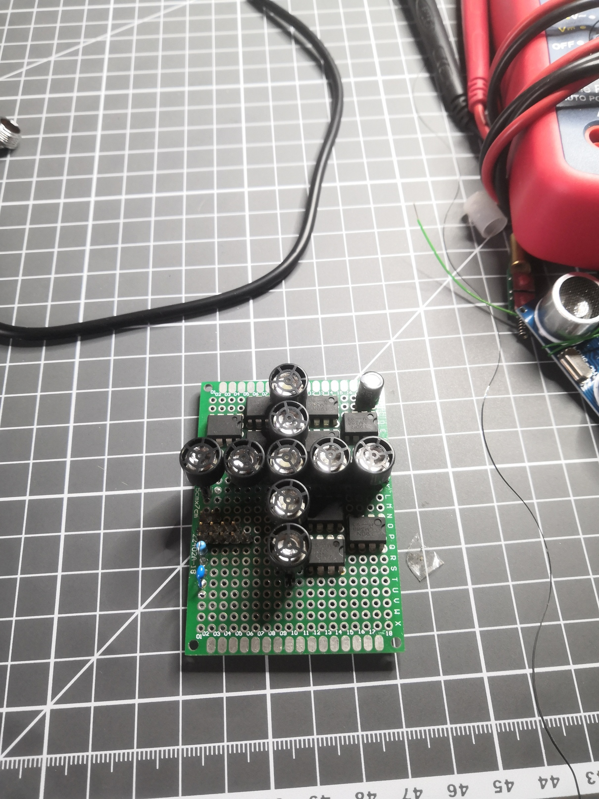
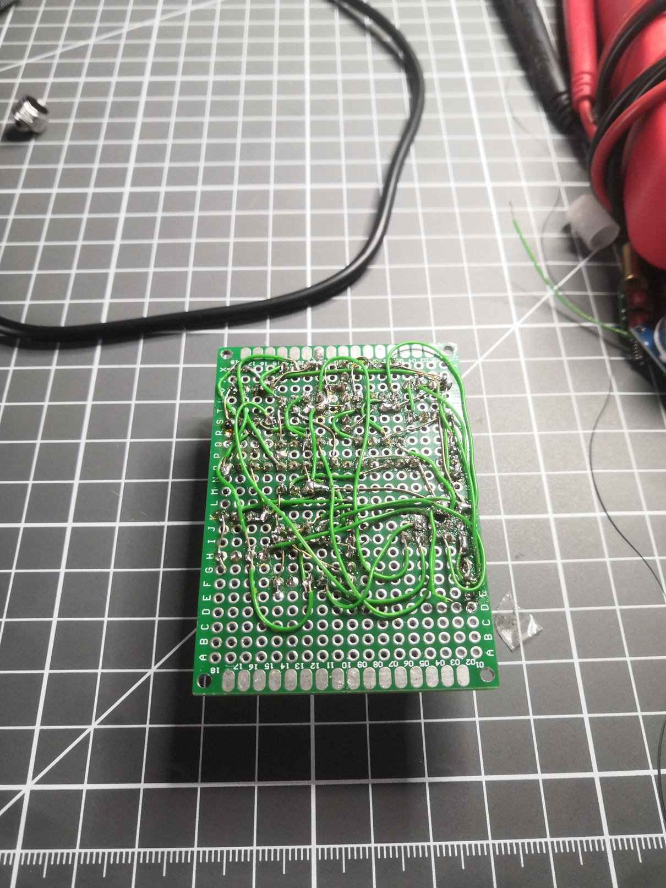
Unfortunately, the signal it gave was too noisy to be used. I had a couple spare HC-SR04. They have a reception stage, so there must be a wire were the analog signal gets amplified before converted digitally? I wired one and used my oscilloscope probes to look for the analog signal. And there it was! I soldered a wire there, connected it to a Teensy 3.2 to do the acquisition. 

<!--
Six months ago, I've taken the first images:
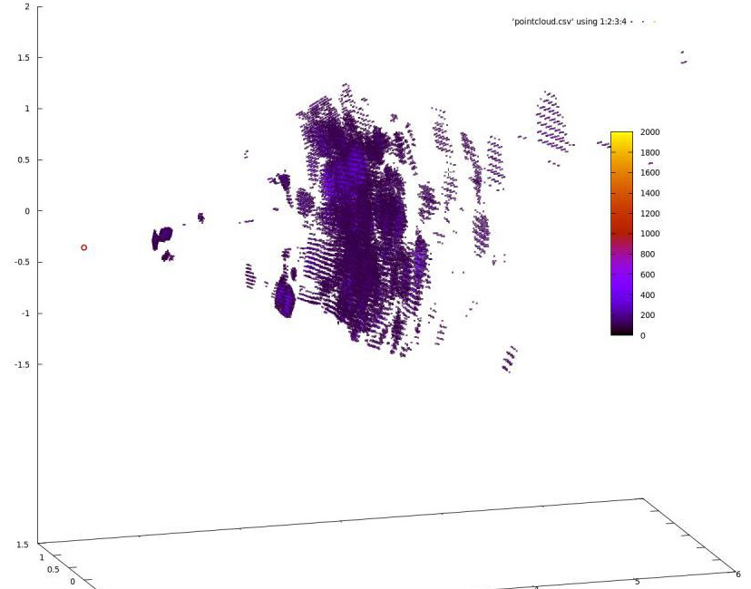

When I started out, I didn't know anything about waves, barely knew how to use an Arduino and 
-->

### Generating the emitter's signal
My transducers are directly driven by 25 shift registers. To drive a shift register, there are three pins: CLOCK, LATCH and DATA. To write a series of bits to a shift register, the algorithm is the following: 

 - Write the first bit on the DATA pin (+5V if you want the first pin of the shift register to be connected to ground, +0V otherwise)
 - Write HIGH on the CLOCK line
 - Write LOW on the CLOCK line
 - Set the second bit on the DATA pin
 - Clock HIGH
 - Clock LOW
 - 3rd bit
 - Clock HIGH
 - Clock LOW
 - etc... done 6 times
 - Write the 8th bit
 - Clock HIGH
 - Clock LOW
 - LATCH HIGH (this tells the shift register to change its output, sort of like a buffer swap in a video game.
 - LATCH LOW

So to change the values in a shift register, you need $`8*3+2=26`$  writes on pins.
My transducers work at 40khz, but I'd like to have around 40 positions for my beam, which means an update rate of  $`40khz*40=1.6Mhz`$. I need 21 Teensy writes for 1 shift register write, which is $`1.6Mhz*21=33.6Mhz`$ 
There are 25 shift registers, so I'need to update my output pins at $`33.6Mhz*25=840Mhz`$.

Ouch! That's going to be hard for a 600Mhz microcontroller! For that sort of requirements, engineers usually use FPGAs. An FPGA is a programmable logic chip which goes much faster for that kind of work. But, I had none on hand so I stayed with the Teensy 3.6.

The advantage of the Teensy is that the digital output values are stored in 32bits registers. I can change all of the pins in parallel using just a couple instructions. By changing all pins in parralel, my code "only" needs to run at 33.6Mhz. By precomputing and storing the register values, I was able to go to that speed quite easily. 

### Tying it all together
Here's the global architecture of my scanner: 

$`[Receiver] \leftrightarrow [PC] \leftrightarrow [Emitter]`$  

The PC tells through the serial port to the Emitter to emit in a specific place (ex: 40° vertical, -20° horizontal), and at the same time tells the receiver to start listening.
Once the receiver hears the emitter's PING, it starts recording. After a few milliseconds, it dumps the data on the serial port.

Then, a python script does a few steps of signal processing: 

$`Signal  \mapsto  Bandpass\,filter \mapsto Hilbert\;Transform  \mapsto  S(t) = t*S(t) \mapsto Thresholding`$ 

Afterwards, all points above a threshold are written as echos and are saved to a file.
After launching gnuplot, I got my first 3D Images
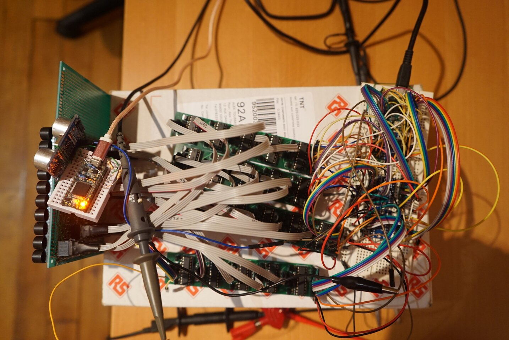
*Here, the receiver is on top at the left*
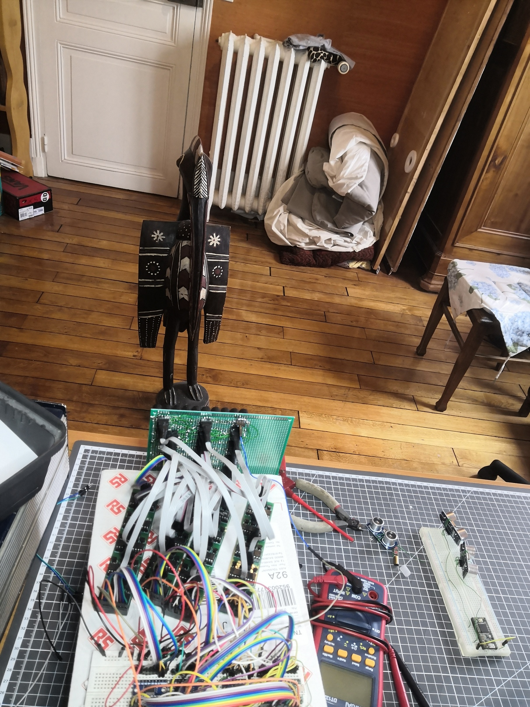
*The room roughly as I scanned it for the first time*
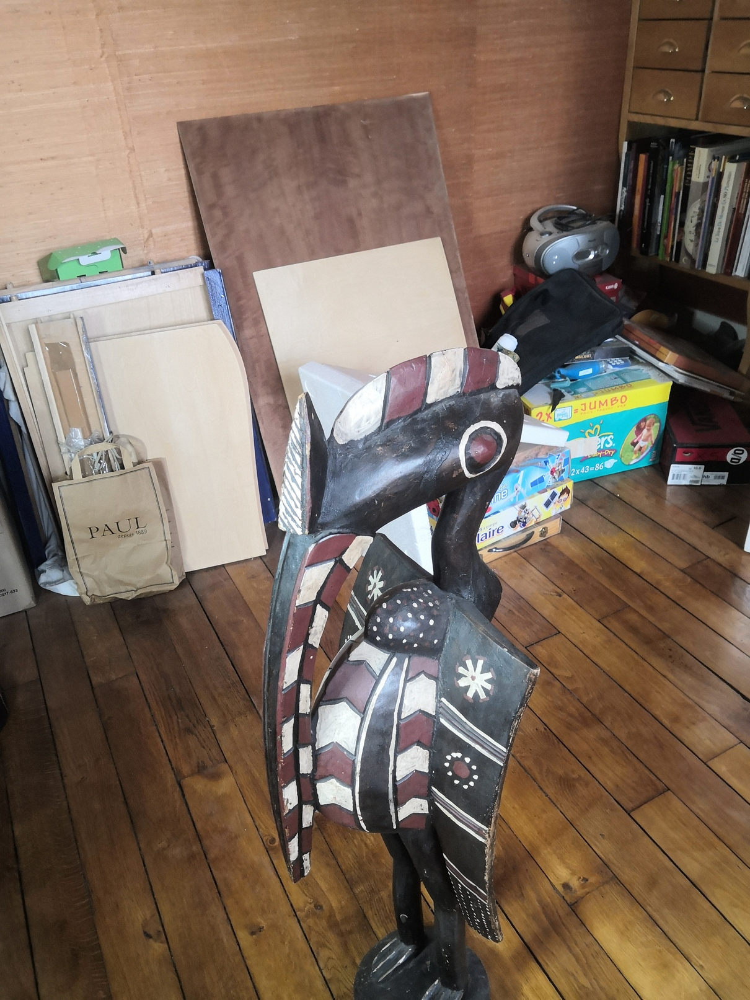
*Close up on that bird, viewed from the right side*

*3D Scan of the whole room. We can clearly see the bird on the front, the wall behind and elements of the wall. The emitter is the red circle on the left*
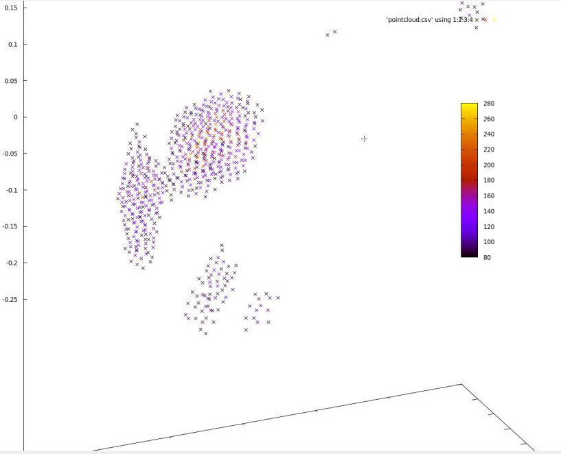
*Zoom on the bird. The legs and most of the torso aren't visible because they're out of the sensor's field of view*

### Limitations
 - The field of view is limited (45° horizontal and vertical)
 - Sometimes the acoustic wave does Emitter -> First Object -> Second Object -> Receiver, so there is sometimes a "gost echo" behind objects.
 - The scan speed is a few milliseconds for a single point, a minute for a full room at full resolution and a second for a 2D plane at full resolution. While enough for a drone which only needs 2D maps most of the time, it could be too slow for some applications.

 I have solutions for each one of these problems, but will keep them for myself ;-) I will try to develop this scanner into a useful commercially-viable solution next year. 

[^1]: 
I was proud of my billion dollar idea, so I showed a drawing of the principle to one of my friends. In a minute, he destroyed it all. "Hey, what happens if a second duck comes here, how do you know if the ducks are side by side or one in front of the other??". I was pissed. I was thinking of doing it for a school project. Instead, we built an acoustic levitation rig.

[^2]:
Simulations done with the excellent Julia programming language.
