title: "How I built an ultrasonic 3d scanner"
description:  Here's how I built an ultrasonic 3d scanner that works in the air, using off-the-shelf components.
-------------------------------
## How I built an ultrasonic 3d scanner

Here's how I built the first ultrasonic 3d scanner in the world that works in the air, using off-the-shelf components (< $100). [^1]

*[I was wrong. I got an email from the founder of the research group at 3dsonar.eu and it seems like I'm second :/]*

Four years ago, I was 15 and wanted to build an autonomous drone to deliver me Coke cans. For that, I needed an accurate 3D map of the surroundings of my drone to avoid walls and objects in its way. Lidars were too expensive and SLAM[^2] didn't work well. There were ultrasonic sensors, but they could only give out the distance to the nearest object in a 40° cone, which wasn't enough for me.

But, if humans can locate the exact direction of a sound, why can't an ultrasonic sensor do it too? That would allow me to scan in 3d.

<!---->

<!--

-->

### First idea: one emitter and multiple receivers.
A transmitter emits a wave, which bounces on objects, and two receivers triangulate the echo to put it on a map.

But, this only works well for one object. As soon as there's a second one at the wrong spot, you can't tell apart one's echo from the other's.
[^3]
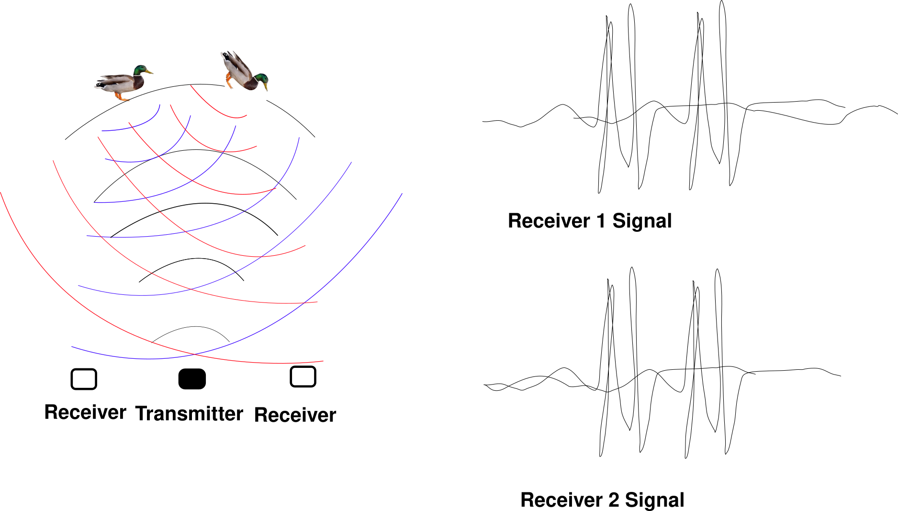

A few guys built scanners based on that. They work well for spotting fingers for a virtual keyboard, but can't handle more than a few objects.

### Two years later: back to the drawing board.
What saved me was the principle of interference. Let's say we have two sound waves in space, let's call them $`F_1(M)`$ and $`F_2(M)`$, where $`F_1(M)`$ returns how far the first wave moves the particles at point M.

$`F_1(M)`$ can be positive or negative. When you see waves on the water, there are places where the water line is below its average—$`F_1(M)`$ negative—and places where the water line is above the average—$`F_1(M)`$ positive. Now, if we call F(M) the "final" displacement of the particles at the point M, we're going to have $`F(M) = F_1(M) + F_2(M)`$.

But what happens in a situation where $`F_1(M) = -F_2(M)`$? Well $`F(M) = 0`$! Particles don't move in M even though there are two non-zero waves there. This phenomenon is called destructive interference. Interferences rule how all wave sources radiate in space. The lightning patterns on the surface of the water, the equations ruling mirrors, lenses and antennas all derive from this superposition principle.

Now it turns out that if you arrange a lot of emitters regularly in a plane, the wave will stay constrained inside of a beam like the one of a lighthouse.
The following arrangement of emitters, all in phase:

$`[E(t)]`$   $`[E(t)]`$  $`[E(t)]`$  $`[E(t)]`$  $`[E(t)]`$  $`[E(t)]`$  $`[E(t)]`$  $`[E(t)]`$

Will give out a beam like that [^4]

The real miracle is that if you delay each emitter's emission time by a linear amount $`n\phi`$, for instance like that:

$`[E(t+\phi)]`$  $`[E(t+2\phi)]`$  $`[E(t+3\phi)]`$  $`[E(t+4\phi)]`$  $`[E(t+5\phi)]`$

Then, the angle at which the beam will point will be proportional to $`\phi`$!
If we control $`\phi`$, we control where the beam points at!

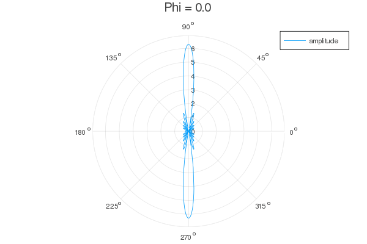

With that principle, I can build a 3D scanner using the following algorithm:

 - Send wave at a specific place
 - Wait for the echo
 - Plot the echo
 - Send wave in another direction
 - Wait for the echo
 - Plot the second echo

.. done all over space, the sensor can scan its environment like a lighthouse.

### If it's so easy, why hasn't anyone done it before?
The problem is that if the emitters are too far apart, there won't be one but three beams. With three beams, scanning is impossible. The emitters have to be as close as half the wavelength to avoid sending sound to the wrong place.

But, commercial ultrasonic transducers are made larger than a wavelength to "pinch" the radiation pattern. They're mostly used for car parking sensors.

I searched on Aliexpress and Banggood for hours, there was no way to find ultrasonic transducers small enough.

After entire evenings spent trying to understand why two additional beams would appear when the emitters were too far apart, some blinking flash of intuition stroke me.

If I imagine my emitters as plates all touching each other, the wave that they produce can only go in the direction of the beam. There can be no second and third beams on the sides. It's one of these intuitions that are hard to explain.

Until now, my simulation and almost all the ones you can find online assume that the emitters are dots with zero radii. And by simulating these sources not as dots but as "plates" (ie, 10 dots in phase put next to each other), the sonar works!

There's still a second beam that appears at high angles, and the max scanning angle is lower than if my emitters were closer than half a wavelength. But it should be able to work!

### Time for frying electronics
I planned to make a 10x10 grid of 10mm transducers. I thought that driving a phased array would be similar to driving an array of LEDs.

I bought hundreds of transducers for $50 on Aliexpress.
To me, all I needed was 74HC595 Shift Registers (that's what they use for driving many LEDs) and an NPN transistor to convert the 5V of the shift registers to the 40V of  the ultrasonic transducers. Then, I'll solder hundreds of these components on a protoboard. I had already built rocket parachute timers on protoboards. I thought it would be the same 🙄.

After I received my components, I tried to make an ultrasonic transducer work. When D13 is HIGH, current flows in the transistor and opens it to the alimentation next to it.
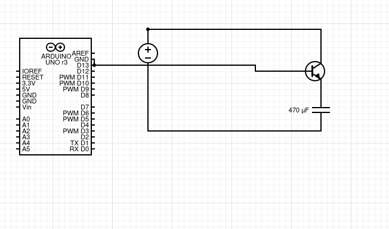

If you've already done electronics before, you've probably laughed out very hard.
An ultrasonic transducer is roughly equivalent to a capacitor.
A capacitor is like a water reservoir, except for electrons.
Therefore, to drive it the circuit needs to empty and to fill that capacitor 40 000 times per second. The NPN capacitor here only cuts out the alimentation of the capacitor, but there's nothing to discharge it.

It took me a few days to understand the issue, I then tried another circuit, the half-bridge:

When D13 is HIGH, the top transistor is open and the bottom transistor is closed. Current goes from the capacitor to the ground, the capacitor gets discharged.
When D13 is LOW, the top transistor is closed and the bottom transistor is open. Current goes from the 40V to the capacitor.

But, In practice, this circuit only works with supply voltages lower than the voltage of the Arduino signal, 5V in my case. The reason for that (and it took me 5 days to figure it out) is that PNP transistors (the kind of the top transistor) are closed when current flows from the top pin to the left pin, and 5V (my Arduino's voltage) isn't enough to stop a voltage from a 40V source to induce a current. I needed to drive it with a 40V signal, which meant ANOTHER transistor! [^5]

Here, the leftmost NPN transistor drives the PNP. The consequence of that is that I need three transistors, three resistors and two Arduino pins for each transducer. That's 300 transistors and 200 Arduino pins ie 200/8 = 25 shift register pins. That's too much to fit close to the transducers.

But at least, this circuit works. It just needs a bit of miniaturization.

Though, with a functional transmitter, I could get my first beam. I connected 8 emitters in parallel to a half-bridge and got a beam!

The emitter is the green light on the bottom. Blue is low signal, white/red/purple is high signal.
I used a Teensy 3.2 which shows the signal intensity as a color on a LED. Then, I took a long-exposure photo while making the teensy travel in the beam. [^6]

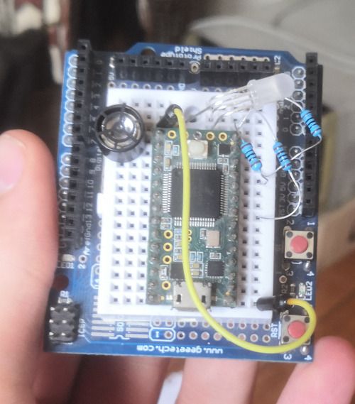

My emitter was working correctly, the beam size matched the simulations.

### Scaling to 100 emitters
Then, I tried to build a half-bridge directly from shift registers. I bought shift registers to replace the PNP transistors and shift registers to replace the NPNs. Those were respectively TPIC9B585Ns and MIC5891s.

It sort of worked, but the timings were different between both shift registers. Because of that, there would be times were both shift registers would be allowing current to pass, which resulted in a short circuit. The MIC5891s had bad timings at high frequencies, so I got back to the drawing board.

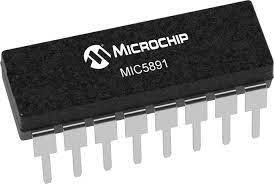

Finally, I realized that both NPNs (the one driving the top PNP and the one putting the capacitor to the ground to empty it) could be replaced by an open-drain shift register (which worked well in my latest experiment). So I finally settled on that. I would only need two shift register pins, a transistor and a resistor for each transducer. That amounts to 25 shift registers, 100 transistors and 100 resistors to solder.

I quickly realized that there would be way too many components to manually solder. I had to design a PCB.

I had never done any EDA before, so I started to learn and use KiCad. Two days later, I had my PCB ready to be manufactured!
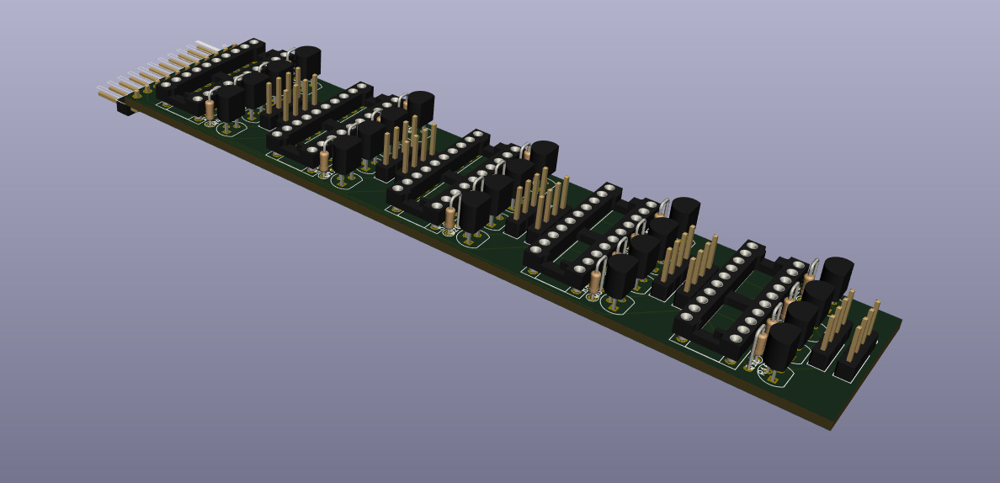

With jlcpcb.com I had my 10 PCBs a week later for $20, including $18 for the fast shipping.
I hated using a Chinese company for a job that could be done in France, but no local companies were offering the same service.

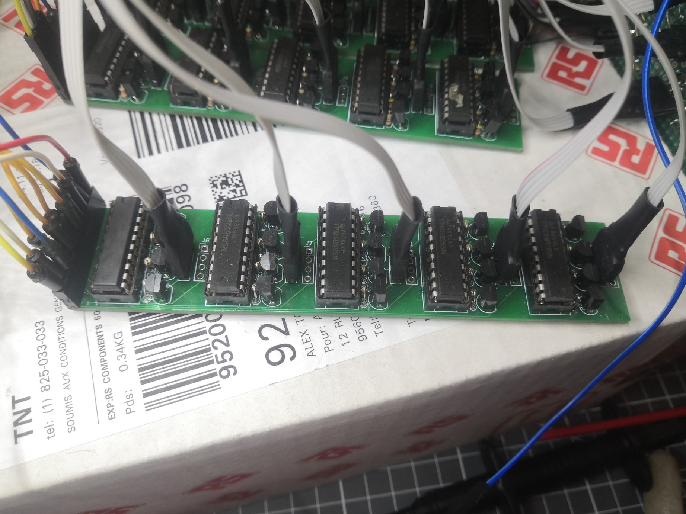

After an evening of soldering the $`8*25+2*100+3*100=700`$ pins of my PCBs, I hooked up the Teensy and... It didn't work.
I had forgotten to set a pin to the ground on each of the TPICs 😐. After adding 25 wires to my PCBs, it worked!

### Mounting the 100 emitters

Then, I had to tightly pack my 100 emitters in a 10x10 grid and connect all of them to my half-bridges. I started with only 40.
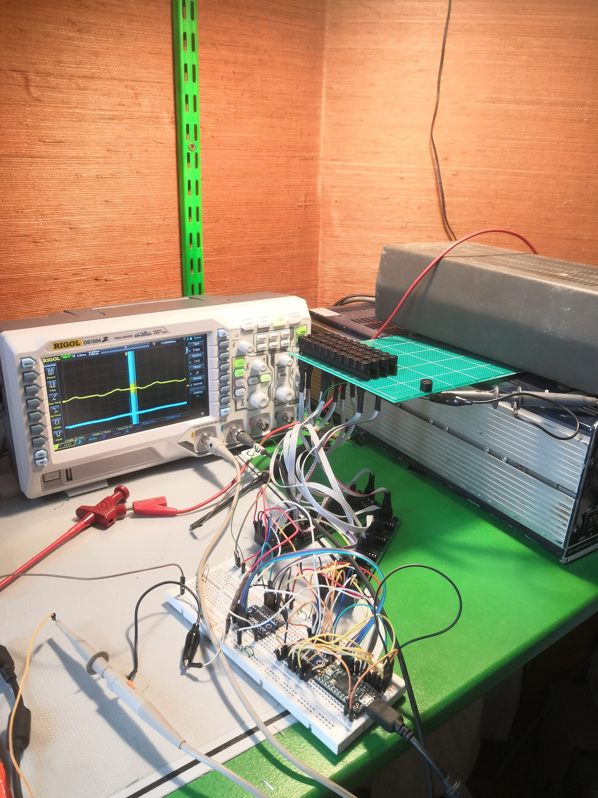
*From bottom to top: Teensy 3.6 which generates the signals, TS1080 to convert the 3.3V signals to 5V, half-bridge PCBs, transducers.*
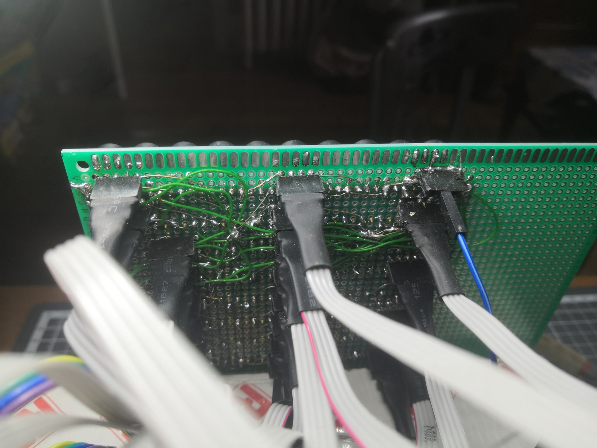
All wires are soldered a l'arrache to the transducers through headers so I can replace or change the polarity of individual transducers easily.

### Receiving the signal
I started doing experiments with beamforming on the reception side for additional precision. I googled for "audio amplifier" and used the first schematic I found. I removed the caps because they're always useless and built this 9x directional receiver with LM386s.
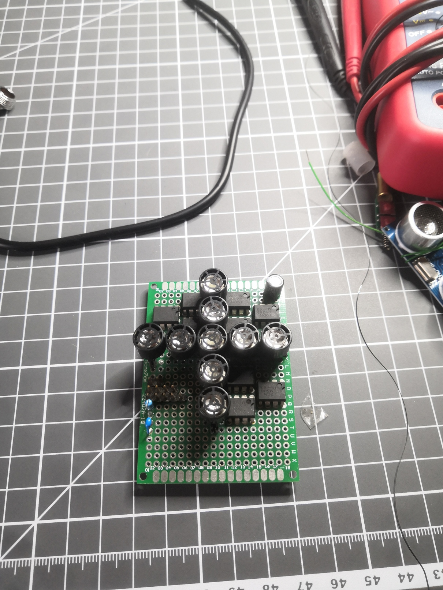
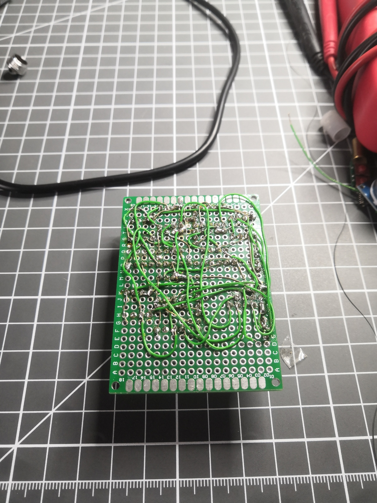
Of course, the signal it gave was too noisy to be used. I had a couple of spare HC-SR04. I wired one and used an oscilloscope probe to look for the analog signal after amplification. I found it and soldered it to the teensy.

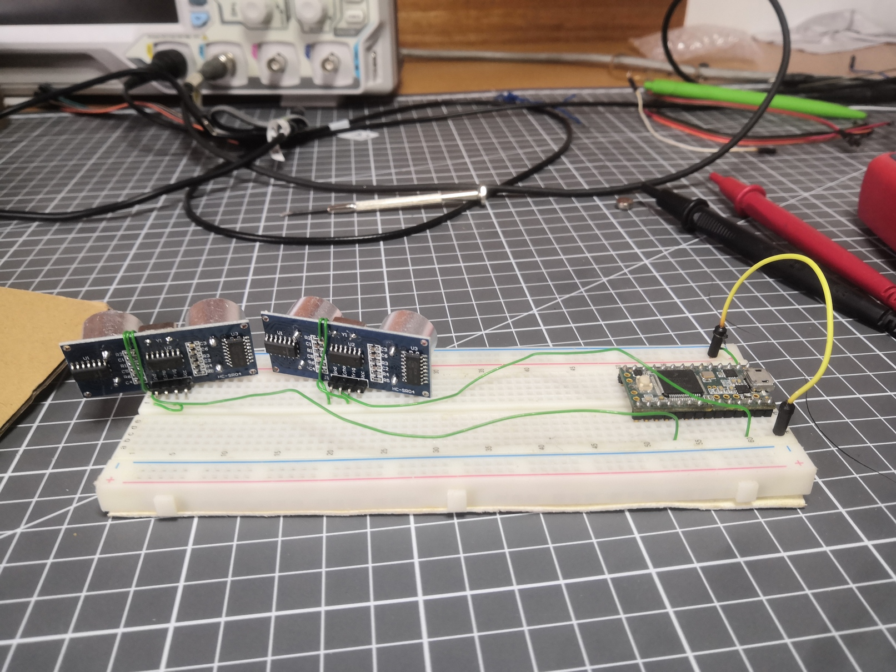
<!--
Six months ago, I've taken the first images:

When I started out, I didn't know anything about waves, barely knew how to use an Arduino and
-->

### Generating the emitter's signal
My transducers are directly driven by 25 shift registers. To drive a shift register, there are three pins: CLOCK, LATCH and DATA. To write a series of bits to a shift register, the algorithm is the following:

 - Write the first bit on the DATA pin (+5V if you want the first pin of the shift register to be connected to the ground, +0V otherwise)
 - Write HIGH on the CLOCK line
 - Write LOW on the CLOCK line
 - Set the second bit on the DATA pin
 - Clock HIGH
 - Clock LOW
 - 3rd bit
 - Clock HIGH
 - Clock LOW
 - etc... done 6 times
 - Write the 8th bit
 - Clock HIGH
 - Clock LOW
 - LATCH HIGH (this tells the shift register to change its output, sort of like a buffer swap in a video game.
 - LATCH LOW

Therefore to change the values in a shift register, I need $`8*3+2=26`$  writes on pins.
My transducers work at 40khz, but I'd like to have 40 positions for my beam, which means an update rate of  $`40khz*40=1.6Mhz`$. I need 21 Teensy writes for 1 shift register write, which is $`1.6Mhz*21=33.6Mhz`$
There are 25 shift registers, so I need to update my output pins at $`33.6Mhz*25=840Mhz`$.

Ouch! That's going to be hard for a 600Mhz microcontroller! For that sort of requirement, engineers usually use FPGAs. An FPGA is a programmable logic chip that goes much faster for that kind of work. But, I had none on hand so I stayed with the Teensy 3.6.

The advantage of the Teensy is that the digital output values are stored in 32bits registers. I can change all of the pins in parallel using just a couple of instructions. By changing all pins in parrallel, my code "only" needs to run at 33.6Mhz. By pre-computing and storing the register values, I was able to go to that speed easily.

### Tying it all together
Here's the global architecture of my scanner:

$`[Receiver] \leftrightarrow [PC] \leftrightarrow [Emitter]`$

The PC tells through the serial port to the Emitter to emit in a specific place (ex: 40° vertical, -20° horizontal), and at the same time tells the receiver to start listening.
Once the receiver hears the emitter's PING, it starts recording. After a few milliseconds, it dumps the data on the serial port.

Then, a python script does a few steps of signal processing:

$`Signal  \mapsto  Bandpass\,filter \mapsto Hilbert\;Transform  \mapsto  S(t) = t*S(t) \mapsto Thresholding`$

Afterward, all points above a threshold are written as echos and are saved to a file.
After launching gnuplot, I got my first 3D Images

*Here, the receiver is on top at the left*
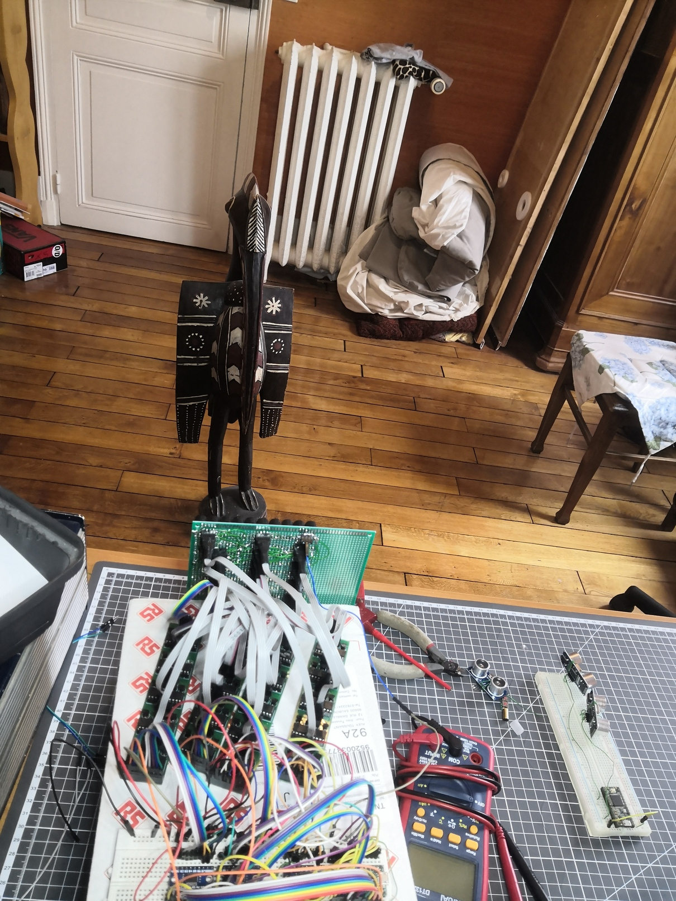
*The room roughly as I scanned it for the first time*
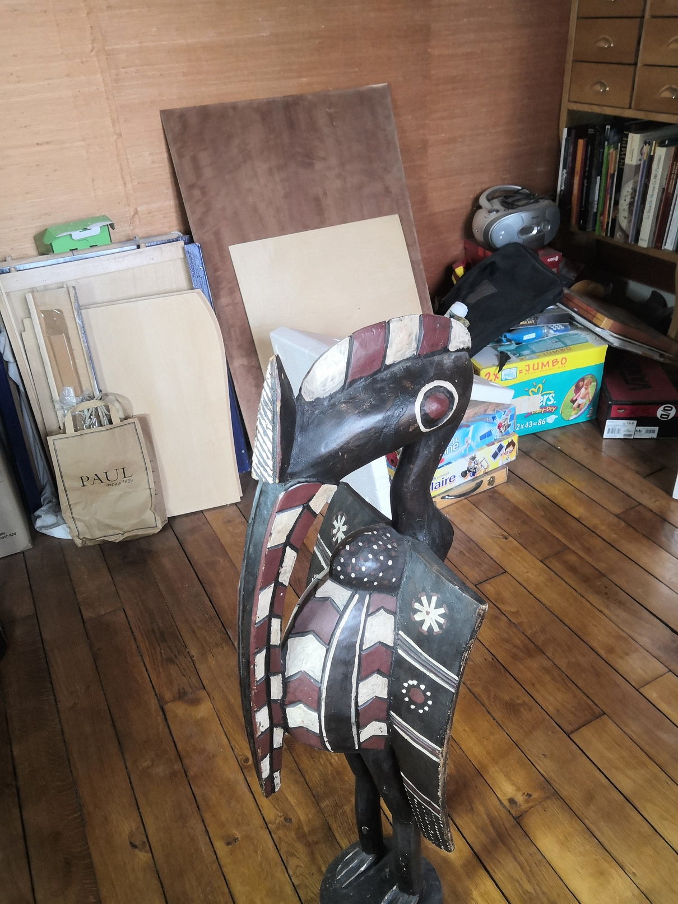
*Close up on that bird, viewed from the right side*

*3D Scan of the whole room. We can see the bird on the front, the wall behind and elements of the wall. The emitter is the red circle on the left*

*Zoom on the bird. The legs and most of the torso aren't visible because they're out of the sensor's field of view*

### Limitations
 - The field of view is limited (45° horizontal and vertical)
 - Sometimes the acoustic wave does Emitter -> First Object -> Second Object -> Receiver, so there is sometimes a "ghost echo" behind objects.
 - The scan speed is a few milliseconds for a single point, a minute for a full room at full resolution and a second for a 2D plane at full resolution. While enough for a drone that only needs 2D maps most of the time, it could be too slow for some applications.
 - The beam is a few centimeters wide so the resolution isn't good.

 I have solutions for each one of these problems but will keep them for myself 😉. I plan to develop this scanner into a useful commercial solution next year.

### Why am I the first?

Getting there was not easy, but could have been doable for a long time. Here are still a few hypotheses:

 - Many who tried to build ultrasonic scanners had only two receivers and tried to correlate the signals. I didn't go that route because the maths were too complicated and because of its topological limitations. here, not being good enough at maths helped me.
 - The phased array beamforming seems impossible when you do the usual calculations. But as I didn't know how to do the usual calculations I did a computer model. It allowed me to be more precise than the usual calculations. This computer model helped me see something the math guys couldn't.
 - For those who still went the phased array route, none of them was crazy enough to go 3D and go from 10 to 100 transducers. My lack of electronics knowledge helped me here. The "usual" solutions weren't small enough. But because I didn't know how hard it would be, I still started. And once I started building the thing, I had to finish it. It pushed me to come up with quite innovative designs that I'm proud of. If I had stayed at the first thinking stage where I designed the circuits to power the transmitter, I would never have built it. When doing new projects or when your knowledge is limited you can't predict how things will turn out. It's better to start working on the easy things and move forward bit by bit. Planning everything is impossible.
 - Because I'm alone, I don't have to ask anyone's opinion before trying less-traveled roads. I guess that if I had been working at a company, no manager would have approved any of my technical choices.

If you've built something similar, reach out to me! I'll add you to the article to correct my lie.

### Get an ultrasonic scanner for yourself
I've published all code and schematics [on github](https://github.com/alextousss/3d_ultrasonic_scanner). If you need any help building the device, email me or open a github issue and I'll write documentation.

My device can help with experiments around radars, beamforming and phased arrays. If you want me to send you one, email me!

### Links
- [HackerNews discussion](https://news.ycombinator.com/item?id=27090795)
- [Hackaday.com article](https://hackaday.com/2021/05/15/a-phased-array-ultrasonic-3d-scanner-from-scratch/)

[^1]:
I searched a bit online for people who did close things. A few guys investigated the principle on hackaday.io, but only a few of them succeeded to build a 2D scanner. None could handle two objects in the same sphere though. There are a few researchers who did articles on the subject, including a team that built a working 2d scanner. Email me if I'm wrong on this.

[^2]:
Simultaneous Localization and Mapping, basically using a camera to compute a 3D map of the world.

[^3]:
I was proud of my billion-dollar idea, so I showed a drawing of the principle to one of my friends. In a minute, he destroyed it all. "Hey, what happens if a second duck comes here, how do you know if the ducks are side by side or one in front of the other??". I was pissed. I was thinking of doing it for a school project. Instead, we built an acoustic levitation rig.

[^4]:
Simulations are done with the excellent Julia programming language.

[^5]:
Courtesy of the Arduino forums and the electronics section of StackOverflow for providing wrong schematics. Don't trust everything you see on the internet :S

[^6]:
